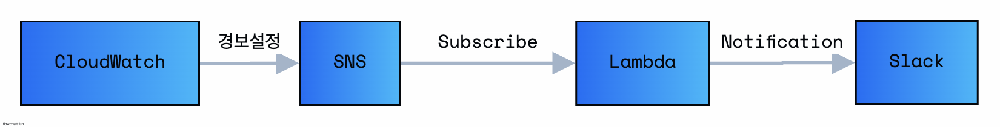

# 23.6.14 간단한 슬랙알림 만들기

## 요구사항

- EB, ALB에서 알람 시스템을 만들어야 했음
- EB, ALB 자체에서 S3로 직접 로그를 쌓고 있지 않았음
- 끊기는지나, Server가 Down됐다는지의 대한 알림이 필요함

## Todo

- [x] EB, ALB의 로깅을 처리하면 어땠을까?

  - EB -> Log Streaming을 활성화 해야 했음
  - ALB -> Access Logging을 활성화 해야 했음
  - 이건 하지 못함

- [x] CloudWatch에 경보설정을 활용하여 진행하기로 함

## 설계



- CloudWatch에서 경보설정을 진행한다 -> 합계로 경보를 설정을 했음
  - 합계, 평균, 최소
  - 1분 ~ n시간 단위로 설정할 수 있음
- SNS로 주제를 선정해서 체크한다
  - SNS로도 할수 있고, 이메일로도 할수 있었는데 -> SNS로 해서 이메일로 쏴도되지 않나?
- Lambda의 Trigger를 SNS에 해당하는 주제로 체크해서 진행한다.
  - golang 선택은 나쁘지 않았지만...
- Lambda 함수에서 Slack Webhook관련된 Notification 로직을 구성하여야 했음

```golang
코드 딱히 어려운건 없어서 귀찮아서 안올림

clear:
	@rm -rf main

build-main:
	@GOOS=linux GOARCH=amd64 go build hello.go

run-zip:
	zip -r function.zip hello

create-function:
	aws lambda update-function-code --function-name sns_notification --zip-file fileb://function.zip

invoke-test:
	aws lambda invoke --function-name sns_notification --cli-binary-format raw-in-base64-out --payload file://request.json response.json

run:
	@make clear
	@make build-main
	@make run-zip
	@make create-function
	@inoke-test
```

## 아쉬운 점

- 무슨 호기로운 생각에 Lambda Runtime으로 golang 썼는데, code 편집기를 못하네? (Application Level)
- Lambda내에서 -> 여러개의 슬랙채널을 두고 어떠한 env 변수나, sns topic주제를 분기해서 매끄럽게 할수는 없었을까? (Application Level)
- CloudWatch에서 경보가 1분마다 설정을하면 -> 계속 오류가 있을때마다 즉 1분마다 Slack 알람이 울릴줄알았는데 -> 그건아니네 -> 한번만 설정된 (SNS에 최소설정 때문인것 같음)
- Slack webhook에서 좀 해당 URL로 접근하거나, Dashboard로 접근하게끔 했다면? 좀더 편하지 않았을까?
