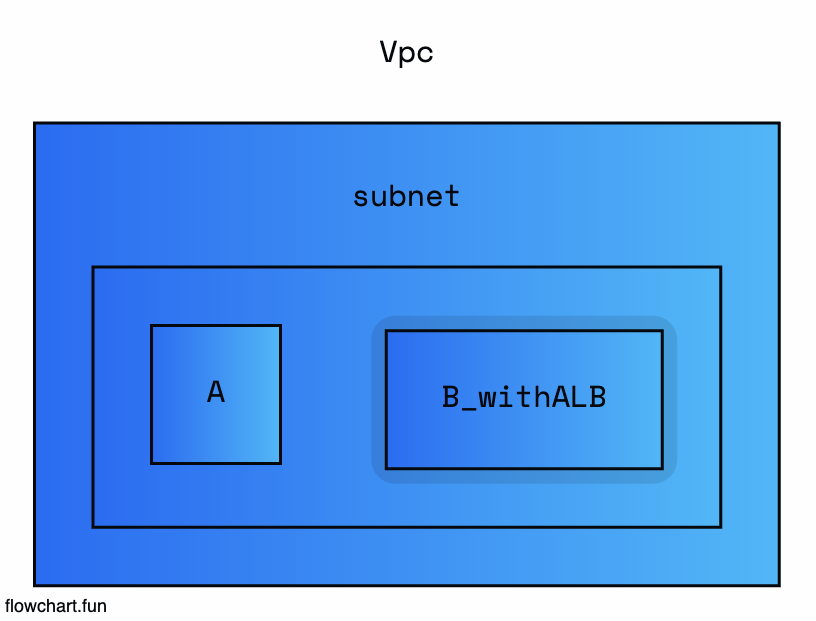

# 23.6.15 같은 서브넷 안에 ECS Fargate끼리의 통신

## 요구사항

- ECS_A 가 ECS_B의 HTTP Request를 하고싶었음
- ECS_B 의 ALB에 SG를 걸었더니, 0.0.0.0/0 모든트래픽했을때만 가능함, 왜 vpc 대역으로 하니까 안되지?

## Todo

- [ ] ECS_A -> ECS_B 통신할때, ALB의 SG를 어떻게 변경하지? (잘못된 생각일 수도 있는거다...)

- 같은 서브넷에서 인스턴스끼리 통신하려면 private_ip로 통신을 한다
  - axios.post(http://private_ip:3000) 통신을 하는데

- A -> B_ALB -> B 통신을 하려니, 당연히 A가 외부로 나갔다가 ALB를 통신해서 B로 접근한다
- 0.0.0.0/0 으로 통신을 하는뜻이나 왜? -> A가 외부로 나갔다가 ALB로 들어온다는게 -> 외부통신...

## 문제제기

- A -> B로 통신을 해야하니까 B 통신할때 그냥 B의 private_ip를 해주면 된다
  - 근데, B가 Fargate 형식이라면 배포할때마다 private_ip, ENI가 계속바뀐다

## 해결책

1. 그냥 A -> B 요청을 할때, ALB로 하되, 0.0.0.0/0 모든 트래픽을 열자

   - 보안상 이슈가 내가생각했을때는... 괜찮나?

2. Route53을 사용해서? Cloud Map을 사용해서? 이러한 이상한 방법도 존재

3. 결국 A가 B의 Coupling을 맺고있다. 그렇다는 건,

   - A는 배포하면 그냥 A배포
   - B를 배포하면 B 배포 후 -> 변경된 private_ip를 A에 반영 -> A를 배포하는 Step Function을 짜면 되지 않을까? (근데 이건 하지 말라고 함...) -> 귀찮긴한데 제일 괜찮았는데...

4. 그렇다면 A, B를 Docker 묶어서 Docker network를 사용해서 하면되지 않을까? -> (이것도 하지 말라고 함) -> 이건 내가 개인적으로 해봐야지...

## 아쉬운점

- 사실 Front -> Backend라면 당연히 외부통신이기때문에 이런문제는 날일이 없어 -> 사실 이문제는 Backend -> Backend를 호출하는 굉장히 특수한 상황때문에 발생한 이슈다.

- 흔하진 않다.
- 근데 3번내지 4번같은 경우를 특히, 해결책 4번을 해봤으면 좋겠다.
  - 왜냐면 ECS 특성상 뭐 굳이 Application 하나만 Docker로 올리라는 법은 없지 않나?
  - Docker 자체내에서 Application 2개정도 있는게 나쁜가? -> 어차피 Fargate인데?
