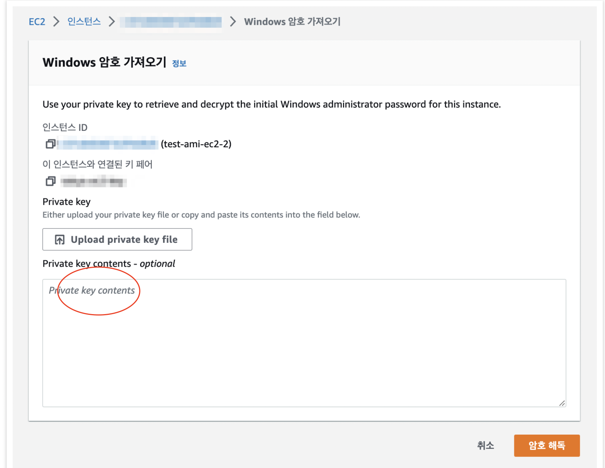
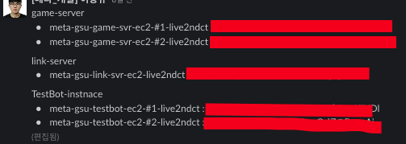
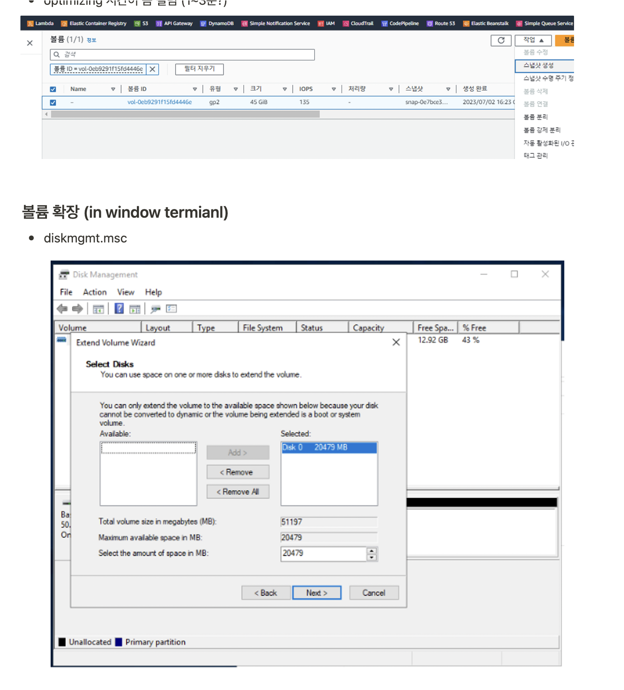

# Window GameServer

## 요구사항

- Window EC2로 관리되는 게임서버들의 관리
- EC2 볼륨확장과 인스턴스 타입변경
- Window EC2의 Disk 메모리 측정을 위한 Cloud-watch agent 설치 및 운용 + Slack Notification 설정
- 게임서버는 기존 Web Server와 뭐가 다른가?
- 실수...

## Window EC2로 관리되는 게임서버들의 관리

- 이번에 Window EC2를 처음 켜봤는데,, 어떻게 들어가냐...
- RDP로 들어간다 3389 port로 들어가는데 ....
- .pem키를 ec2에 등록한 후에 -> ec2 보안 -> 암호보기로 본다... 굉장히 복잡하다.
- 이걸 못해서 5개 인스턴스 개해맸다..
- 근데 사실 이마저도 -> public_ip를 연결해서 acm으로 dns를 잡아서 드려야 했다. 처음이라 너무 해멤 그리고 오래걸렸음...

## EC2 볼륨확장과 인스턴스 타입변경

- 사실 너무나도 간단한 거였는데, 너무 얼타서 그런지.. 실수를 했다.
- ec2 볼륨확장부분은 각 스토리지의 수정을 해서 30 -> 200으로 늘리면된다.
- 그리고, window instance로 들어가서 -> 직접 다시 allocation을 해줘야 한다.
- 그리고 인스턴스 변경은 그냥 중지후에 바꾸면 되는데 -> 미쳐가지고 인스턴스 날리고 다시 만듬... -> Disk 안날려달라고 나중에 피드백받음

## Window EC2의 Disk 메모리 측정을 위한 Cloud-watch agent 설치 및 운용 + Slack Notification 설정

- 이렇게 볼륨확장된 인스턴스에서 게임서버 특성 상, 메모리 부족으로 인한 우려로 인해... disk의 대한 알림처리를 받기 원했음
- ec2 instance에 cloudwatch agent를 설치해서, 10~60초에 한번씩 기재된 내용의 cpu, memory, disk의 사용량을 측정한다.
- 그리고 사용량을 측정하고 그거에 대한 경보 설정 후 -> sns 설정하고 -> slack notification 설정함

<a href="https://www.notion.so/window-Cloud-Watch-Agent-eb5ddb86f46640a9bade3931e99fde06?pvs=4">윈도우인스턴스 볼륨확장 & cloud-watch agent설치법 기재해놓음 (일단 나만 봄)</a>

## 게임서버는 기존 Web Server와 뭐가 다른가?

- 이게 내가 제일 해맨건데...
- 일단 게임서버는 Stateful 하다. 그리고 web server? 는 stateless한데... 여기서 문제는
- 만약에 업데이트나 점검중이라는 건? 게임서버가 끊겼다라는 얘기다. 즉 머신(인스턴스) 을 종료했다거나, 게임서버 (인스턴스 안) 를 중지했다거나이다.
- 이번에 Rolling update하면서 NLB Target group Dettach -> EC2 볼륨확장 -> EC2 머신 재시작 -> NLB Target group Attach 하는 방식으로 업데이틀 했는데
- 내가 머신 재시작하는걸 빼먹어서 욕 개먹음

## 실수...

- 사실 실수가 너무 많았음
- window instance 및 게임서버 관리는 처음이고 하니까 너무 얼탔음
- 다신 이러지 말자...
- 일단 너무 어려웠음
