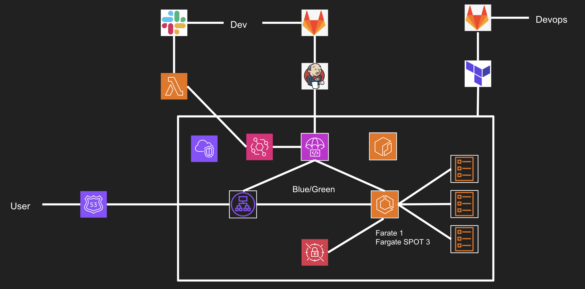

# ECS CI/CD 배포 총정리

## 요구사항

- 팀 내부에 ECS로 전환하라
- ECS로 전환하면서



## User

- User -> Route53 -> ALB -> ECS (Fargate) -> Task...
- 유저는 그냥 Domain을 사용해서 ECS를 볼수있음

## Dev

- Gitlab (Application Repository) -> Jenkins -> CodeDeploy -> ALB (Blue/Green) -> ECS 배포

## Devops

- Gitlab (Deploy Repository) -> Terraform -> Infra 구성

## Conclusion

- Dev와 Devops의 Gitlab Repository를 따로 찢어놓음
- ECS는 Secret Manager를 사용하여 Env를 가져옴 이때
- ECS Fargate 즉 Container는 ssh로 접근이 안된다 다만... -> SSM으로 접근은 가능하다.

  - <a href="https://docs.aws.amazon.com/systems-manager/latest/userguide/session-manager-working-with-install-plugin.html"> Session Manager Plugin 설치 </a>
  - ecs taskArn의 SessionMangaer의 권한을 추가해야 함

    ```
    resource "aws_iam_policy" "session-manager" {
    name = "ecs-session-manager"
    path = "/"

    policy = jsonencode({
        Version = "2012-10-17"
        Statement = [
            {
                "Effect" : "Allow",
                "Action" : [
                    "ssmmessages:CreateControlChannel",
                    "ssmmessages:CreateDataChannel",
                    "ssmmessages:OpenControlChannel",
                    "ssmmessages:OpenDataChannel"
                ],
                "Resource" : "\*"
            }
        ]
    })
    }
    ```

  - 그리고 TaskDefiniton에 TaskArn이 기재돼야함 (이걸로 시간 개날림...) -> CodeDeploy가 배포가 안됨

    ```
        ...
        "taskRoleArn": "arn:aws:iam::021206237994:role/mpx-ecs-codeDeploy-role", <- 이자식 추가해야함
        "executionRoleArn": "arn:aws:iam::021206237994:role/mpx-ecs-codeDeploy-role",
        "networkMode": "awsvpc",
        "requiresCompatibilities": ["FARGATE"],
        "cpu": "2048",
        "memory": "4096"
    ```

  - 그리고 애초에 ECS Service를 만들때 enalbe_execute_command를 활성화 해야함 ... 나중에 Terraform으로 구성을 해봐야 할듯..

## 푸념

- CodeDeploy를 활용해서 결국 Blue/green 배포를 할수있게 됐고 사실 너무 어렵스...
- 한 3주 정도 테라폼으로도 구성했었는데 어렵구만 어려워... 정리를 한번에 해야할듯함
